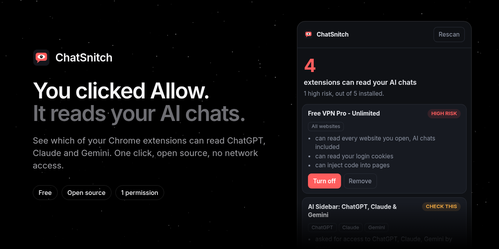

<p align="center">
  
</p>

<p align="center">
  <b>See which of your Chrome extensions can read your ChatGPT, Claude and Gemini chats.</b><br>
  One click. One permission. No network access. Open source.
</p>

<p align="center">
  <a href="https://github.com/Swastikkkkk/chatsnitch/stargazers"></a>
  <a href="https://github.com/Swastikkkkk/chatsnitch/actions/workflows/ci.yml"></a>
  <a href="https://github.com/Swastikkkkk/chatsnitch/releases/latest"></a>
  
  
  <a href="LICENSE"></a>
</p>

<p align="center">
  <a href="https://chatsnitch.vercel.app/?ref=github">Website</a> ·
  <a href="https://github.com/Swastikkkkk/chatsnitch/releases/latest/download/chatsnitch.zip">Download</a> ·
  <a href="#install-in-60-seconds">Install</a> ·
  <a href="#how-it-decides">How it decides</a>
</p>

---

## Why this exists

Chrome extensions keep getting caught reading AI conversations and sending them to someone else's server:

| When | What happened | Scale |
|---|---|---|
| Dec 2025 | Two fake AI extensions, one with Google's Featured badge, exfiltrated ChatGPT and DeepSeek chats every 30 minutes ([OX Security](https://www.ox.security/blog/malicious-chrome-extensions-steal-chatgpt-deepseek-conversations/)) | 900K users |
| Dec 2025 | Urban VPN Proxy and 7 sister extensions auto-updated into capturing chats on ChatGPT, Claude, Gemini, Copilot and more ([Koi Security via Malwarebytes](https://www.malwarebytes.com/blog/news/2025/12/chrome-extension-slurps-up-ai-chats-after-users-installed-it-for-privacy)) | 8M+ installs |
| Jun 2026 | Smart Sidebar, Chat AI and Urban VPN caught spying on eight AI chat sites ([G DATA](https://blog.gdatasoftware.com/2026/06/38428-browser-addons-spy-on-ai-chats)) | 470K+ users |

Every report ends with "review your extension permissions". That takes minutes per extension, and most people have twenty. ChatSnitch does it in one click.

<p align="center">
  
</p>

## What you get

- **A count** of extensions that can see your AI chats right now
- **A risk level** for each: high risk, check this, or low
- **The reasons, in plain words**: reads every site, asked for claude.ai by name, reads your cookies, watches network traffic, injects code, reads your clipboard, was installed by another program
- **Turn off / Remove** right there, and Turn back on if you change your mind

Covers ChatGPT, Claude, Gemini, Copilot, DeepSeek, Perplexity, Grok, Meta AI, Mistral and Poe.

## Install in 60 seconds

Chrome Web Store listing is in progress. Until then:

1. [Download `chatsnitch.zip`](https://github.com/Swastikkkkk/chatsnitch/releases/latest/download/chatsnitch.zip) and unzip it
2. Open `chrome://extensions` and switch on **Developer mode** (top right)
3. Click **Load unpacked** and pick the unzipped folder

Works in Chrome, Edge, Brave and other Chromium browsers.

## How it decides

The scoring lives in [`extension/analyze.js`](extension/analyze.js), about 160 lines with no dependencies.

1. **Collect access.** It reads each extension's host permissions from `chrome.management`. That API leaves out content-script access, which is exactly how the AI-sidebar stealers read pages, so it also parses Chrome's own permission warnings ("Read and change your data on chatgpt.com, claude.ai...") back into match patterns. Those warnings are localized, so ChatSnitch asks Chrome for its exact wording of "all websites" in your language with `getPermissionWarningsByManifest`.
2. **Match AI sites.** Chrome match patterns are checked against each AI chat domain. `*.google.com` counts as Gemini on purpose. It errs toward flagging.
3. **Score.** Named AI domains score higher than "all sites", because a sidebar asking for chatgpt.com by name is the stealer pattern and a dark-mode extension reading everything usually isn't. Cookies, webRequest, scripting, debugger, clipboard and native messaging each add risk. Sideloaded installs add the most.

Verified in a real Chromium with five decoy extensions: it flagged the four that can read AI chats, ignored the tab counter, and Turn off disabled the fake VPN.

## Why you can trust it

An extension that inspects your extensions should be the most boring one you install.

- **One permission:** `management`. It lists extensions and can turn them off.
- **No site access.** It can't read any page, your chats included.
- **No network.** `connect-src 'none'` in its content security policy. It can't phone home.
- **Small.** Under 300 lines of plain JavaScript, no build step. Read it before you install it.

## Limits

- It shows what an extension is *allowed* to do, not whether it is actually stealing.
- Access you restricted to "On click" in Chrome still shows as granted.
- Works in every Chrome UI language: ChatSnitch asks Chrome how it words "all websites" in yours. Tested in English, German, Hindi, French, Spanish and Japanese.
- No Firefox build yet.

## Roadmap

- [ ] Chrome Web Store listing
- [x] Every Chrome UI language (v0.2.0)
- [ ] Firefox (WebExtensions `management` API)
- [ ] Alert when an installed extension gains new AI-site access after an update
- [ ] Export a report to share with your IT team

Help on any of these is welcome. See [CONTRIBUTING.md](CONTRIBUTING.md).

## Develop

```bash
npm test                          # 23 tests on the analyzer, using real Chrome warning strings
cd web && npm install && npm run dev   # landing site (needs web/.env, see web/.env.example)
```

Scan a browser profile from the command line, without installing anything (read-only):

```bash
node tools/scan-profile.mjs            # finds Chrome, Edge and Brave profiles automatically
node tools/scan-profile.mjs "<path to a profile folder>"
```

| Path | What |
|---|---|
| `extension/` | The extension. No build step. |
| `tests/` | Analyzer tests (`node --test`). |
| `web/` | [chatsnitch.vercel.app](https://chatsnitch.vercel.app/?ref=github): Vite, React, Tailwind, GSAP, Aceternity UI. |
| `supabase/` | Waitlist and cookieless analytics schema for the site. The extension never talks to it. |

## Star history

<a href="https://star-history.com/#Swastikkkkk/chatsnitch&Date">
  
</a>

If ChatSnitch found something in your browser, starring the repo helps other people find it.

MIT licensed. Built by [Swastik](https://github.com/Swastikkkkk).
